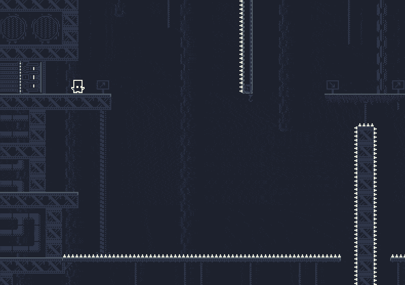
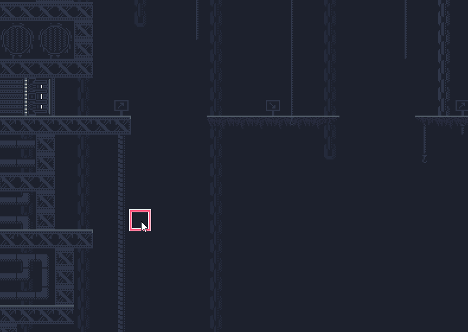
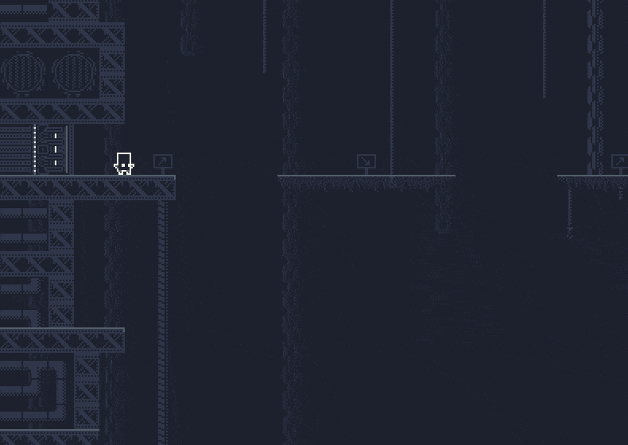
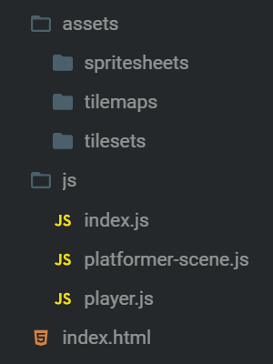
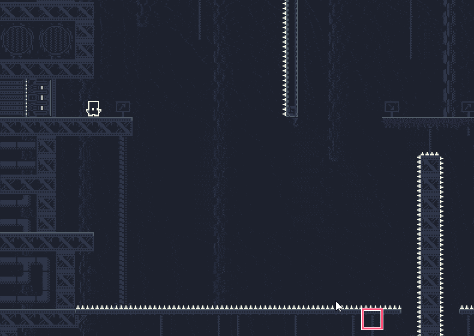
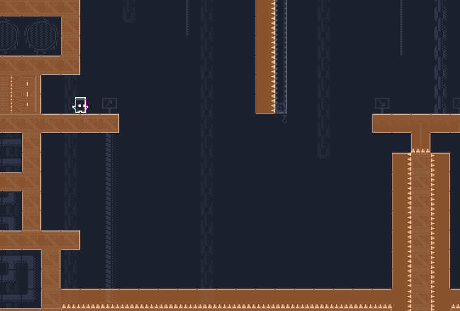
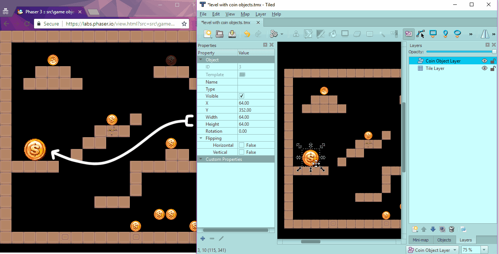
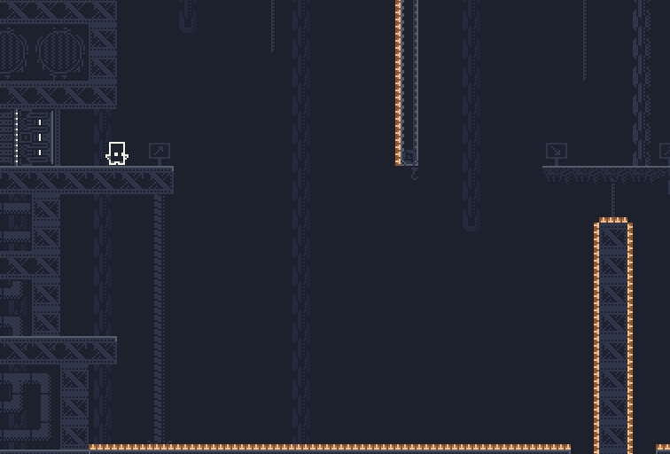

# Modular Game Worlds in Phaser 3 (Tilemaps #2) - Dynamic Platformer

Author: [Mike Hadley](https://www.mikewesthad.com/)

Reading this on GitHub? Check out the [Medium Post](https://medium.com/@michaelwesthadley/modular-game-worlds-in-phaser-3-tilemaps-2-dynamic-platformer-3d68e73d494a)

This is a series of blog posts about creating modular worlds with tilemaps in the [Phaser 3](http://phaser.io/) game engine. If you haven't, check out the first [post](https://medium.com/@michaelwesthadley/modular-game-worlds-in-phaser-3-tilemaps-1-958fc7e6bbd6) where we used static tilemaps to create a Pokémon-style game world. In this post, we'll dive into dynamic tilemaps and create a puzzle-y platformer where you can draw platforms to help get around obstacles:



_↳ Final example that we'll create_

The next [post](https://medium.com/@michaelwesthadley/modular-game-worlds-in-phaser-3-tilemaps-3-procedural-dungeon-3bc19b841cd) covers creating a procedural dungeon world, and the one after that will cover integrating [Matter.js](http://brm.io/matter-js/) to create a wall-jumping platformer.

Before we dive in, all the source code and assets that go along with this post can be found in [this repository](https://github.com/mikewesthad/phaser-3-tilemap-blog-posts/tree/master/examples/post-2). These tutorials use the latest version of Phaser (v3.16.2) and Tiled (v1.2.2) as of 02/26/19. Some pairings of older versions of Phaser and Tiled don't get along well, so I recommend using these two version.

## Intended Audience

This post will make the most sense if you have some experience with JavaScript (classes, arrow functions & modules), Phaser and the [Tiled](https://www.mapeditor.org/) map editor. If you don't, you might want to start at the beginning of the [series](https://medium.com/@michaelwesthadley/modular-game-worlds-in-phaser-3-tilemaps-1-958fc7e6bbd6), or continue reading and keep Google, the Phaser tutorial and the Phaser [examples](https://labs.phaser.io/) & [documentation](https://photonstorm.github.io/phaser3-docs/index.html) handy.

Alright, Let's get into it!

## The Tilemap API

Before we build the platformer, let's start with a bird's-eye view of the tilemap API. We talked about the following bits last time:

- [`Tilemap`](https://photonstorm.github.io/phaser3-docs/Phaser.Tilemaps.Tilemap.html)
- [`Tileset`](https://photonstorm.github.io/phaser3-docs/Phaser.Tilemaps.Tileset.html)
- [`StaticTilemapLayer`](https://photonstorm.github.io/phaser3-docs/Phaser.Tilemaps.StaticTilemapLayer.html)

In this post, we'll dive into two new pieces of the API:

- [`DynamicTilemapLayer`](https://photonstorm.github.io/phaser3-docs/Phaser.Tilemaps.DynamicTilemapLayer.html)
- [`Tile`](https://photonstorm.github.io/phaser3-docs/Phaser.Tilemaps.Tile.html)

A `Tilemap` isn't a display object. It holds data about the map and can contain one or more layers, which are the display objects that actually render `Tile` objects. They come in two flavors: `StaticTilemapLayer` & `DynamicTilemapLayer`. A `StaticTilemapLayer` is fast, but the tiles in that layer can't be modified and can't render per-tile effects like flipping or tint. A `DynamicTilemapLayer` trades some speed for the flexibility and power of manipulating individual tiles.

Static and dynamic layers share much of the same API. They both have methods for checking whether a tile exists (e.g. `hasTileAt`). They both have methods for getting access to tiles in the map (`getTileAt`,`findTile`, `forEachTile`, etc.). Dynamic layers have a set of additional methods for adding, removing, randomizing, etc. tiles within the layer (e.g. `putTileAt`, `removeTileAt`, `randomize`, etc.).

The tilemap API is flexible, so you can choose the right tool for the job. You can mix static and dynamic layers together in the same map. You can also convert a dynamic layer into a static layer, allowing you to generate a level on the fly and then optimize it.

## Painting Tiles

For the first example, we'll load up a level made with Tiled and then paint & erase tiles on the fly. We couldn't use static layers here, so we'll need to reach for dynamic layers.



_↳ Tileset by 0x72 under CC-0, https://0x72.itch.io/16x16-industrial-tileset_

We set up dynamic layers in the same way as static layers, except using [`map.createDynamicLayer`](https://photonstorm.github.io/phaser3-docs/Phaser.Tilemaps.Tilemap.html#createDynamicLayer__anchor) instead of [`map.createStaticLayer`](https://photonstorm.github.io/phaser3-docs/Phaser.Tilemaps.Tilemap.html#createStaticLayer__anchor):

```js
let groundLayer;

function preload() {
  this.load.image("tiles", "../assets/tilesets/0x72-industrial-tileset-32px-extruded.png");
  this.load.tilemapTiledJSON("map", "../assets/tilemaps/platformer.json");
}

function create() {
  const map = this.make.tilemap({ key: "map" });
  const tiles = map.addTilesetImage("0x72-industrial-tileset-32px-extruded", "tiles");

  map.createDynamicLayer("Background", tiles);
  groundLayer = map.createDynamicLayer("Ground", tiles);
  map.createDynamicLayer("Foreground", tiles);
}
```

<!-- https://gist.github.com/mikewesthad/1ec0d8bfdb27d52b5fb29d67fc1aee9a -->

Once you've got a dynamic layer loaded up, you can start manipulating tiles using the [DynamicTilemapLayer API](https://photonstorm.github.io/phaser3-docs/Phaser.Tilemaps.DynamicTilemapLayer.html):

```js
// Put tile index 1 at tile grid location (20, 10) within layer
groundLayer.putTileAt(1, 20, 10);

// Put tile index 2 at world pixel location (200, 50) within layer
// (This uses the main camera's coordinate system by default)
groundLayer.putTileAtWorldXY(2, 200, 50);
```

<!-- https://gist.github.com/mikewesthad/376bb39c3de856cd93b22f970bd765c8 -->

The tilemap layer (and tilemap) methods that get or manipulate tiles often come in pairs. One method - like [`putTileAt`](https://photonstorm.github.io/phaser3-docs/Phaser.Tilemaps.DynamicTilemapLayer.html#putTileAt__anchor) - will operate on tile grid units, e.g. (0, 2) would correspond to the first column and third row of the layer. The other method - like [`putTileAtWorldXY`](https://photonstorm.github.io/phaser3-docs/Phaser.Tilemaps.DynamicTilemapLayer.html#putTileAtWorldXY__anchor) - will operate in world pixel units, making it easier to do things like find which tile is under the mouse. There are also methods for converting from tile grid units to world pixel coordinates and vice versa: [`worldToTileXY`](https://photonstorm.github.io/phaser3-docs/Phaser.Tilemaps.DynamicTilemapLayer.html#worldToTileXY__anchor), [`tileToWorldXY`](https://photonstorm.github.io/phaser3-docs/Phaser.Tilemaps.DynamicTilemapLayer.html#tileToWorldXY__anchor).

Putting these methods together with Phaser input, we can draw tiles in a layer with the mouse:

```js
function update() {
  // Convert the mouse position to world position within the camera
  const worldPoint = this.input.activePointer.positionToCamera(this.cameras.main);

  // Draw tiles (only within the groundLayer)
  if (this.input.manager.activePointer.isDown) {
    groundLayer.putTileAtWorldXY(353, worldPoint.x, worldPoint.y);
  }
}
```

The following example puts all of this together and allows you to paint tiles by clicking and erase tiles by clicking while holding shift. `worldToTileXY` & `tileToWorldXY` are used to create a simple graphic overlay to visualize which tile the mouse is currently over.

Note: you'll want to click on the "Edit on CodeSandbox" button and check out the code in full screen where you can see all the files easily.

[](https://codesandbox.io/s/31xpvv85om?hidenavigation=1&module=%2Fjs%2Findex.js&moduleview=1)

<!-- Embed link for medium: https://codesandbox.io/s/31xpvv85om?hidenavigation=1&module=%2Fjs%2Findex.js&moduleview=1 -->

_↳ Check out the [CodeSandbox](https://codesandbox.io/s/31xpvv85om?hidenavigation=1&module=%2Fjs%2Findex.js&moduleview=1), [live example](https://www.mikewesthad.com/phaser-3-tilemap-blog-posts/post-2/01-drawing-tiles) or the source code [here](https://github.com/mikewesthad/phaser-3-tilemap-blog-posts/blob/master/examples/post-2/01-drawing-tiles)._

## Modularizing Our Code

Adding or removing individual tiles is pretty easy, so let's step up the complexity and build the foundations of a platformer:



Thus far, we've gotten up and running quickly with Phaser using a single file that has `preload`, `setup` and `update` functions. That's great for simple examples, but becomes a nightmare once you get to anything moderately complex.

To build our platforming foundation, we want to split up that monolithic file structure into easier-to-digest, isolated files called "modules." There are a lot of reasons go modular with your code. If used well, they help create portable & reusable chunks of code that are easier to think about. If you aren't familiar with modules, check out the [modules chapter](https://eloquentjavascript.net/10_modules.html) from _Eloquent JavaScript_ or [this overview](https://blog.cloud66.com/an-overview-of-es6-modules-in-javascript/).

If you are using a modern browser (roughly anything late 2017 onward), you can use modules in your project (without needing webpack, parcel, etc.) by adding the `type="module"` attribute in your HTML like this:

```html
<script src="./js/index.js" type="module"></script>
```

<!-- https://gist.github.com/mikewesthad/785ebd034485af6eb3f6f34a64cbd9f4 -->

(Note: you won't see this in the CodeSandbox demos since they use the [Parcel bundler](https://parceljs.org/) to enable module support, but you will see it in the [source code](https://github.com/mikewesthad/phaser-3-tilemap-blog-posts/tree/master/examples/post-2) for this series.)

Inside of index.js, you can now [`import`](https://developer.mozilla.org/en-US/docs/Web/JavaScript/Reference/Statements/import) functions, objects, or primitive values from other files that have at least one [`export`](https://developer.mozilla.org/en-US/docs/web/javascript/reference/statements/export). `import` and `export` provide ways for us to split our single file code into separate files. With that in mind, here's what our new project structure looks like:



```
.
├── assets/
|
├── js/
|  |
|  ├── index.js
|  |     Creates the Phaser game from our config
|  |
|  ├── platformer-scene.js
|  |     The new home of our scene (e.g. preload, create, update)
|  |
|  └── player.js
|        Handles player movement and animations
|
└── index.html
      Loads up index.js
```

<!-- https://gist.github.com/mikewesthad/ee22cce7dc345580425a15c18619c904 -->

Check out the code below, starting with index.js. From there, when you see an `import`, look at the file that's being referenced to follow the thread. This will be the basis we build upon for the next section.

[](https://codesandbox.io/s/p5pqqjk6q0?hidenavigation=1&module=%2Fjs%2Findex.js&moduleview=1)

<!-- Embed link for medium: https://codesandbox.io/s/p5pqqjk6q0?hidenavigation=1&module=%2Fjs%2Findex.js&moduleview=1 -->

_↳ Check out the [CodeSandbox](https://codesandbox.io/s/p5pqqjk6q0?hidenavigation=1&module=%2Fjs%2Findex.js&moduleview=1), [live example](https://www.mikewesthad.com/phaser-3-tilemap-blog-posts/post-2/02-modules-demo) or the source code [here](https://github.com/mikewesthad/phaser-3-tilemap-blog-posts/blob/master/examples/post-2/02-modules-demo)._

Breaking down every line of code here is a bit out of the scope of the post, but let's look at a trimmed down version of player.js before moving on:

```js
export default class Player {
  constructor(scene, x, y) {
    this.scene = scene;

    // Create the physics-based sprite that we will move around and animate
    this.sprite = scene.physics.add
      .sprite(x, y, "player", 0)
      .setDrag(1000, 0)
      .setMaxVelocity(300, 400)
      .setSize(18, 24)
      .setOffset(7, 9);

    // Set up animations & keyboard input (see CodeSandbox)
  }

  update() {
    // Move sprite & change animation based on keyboard input (see CodeSandbox)
  }

  destroy() {
    this.sprite.destroy();
  }
}
```

<!-- https://gist.github.com/mikewesthad/98f42b21c1830eeb63b986261f5875ea -->

This sets up an important pattern by letting us separate the bulk of the player logic from platformer-scene.js. The scene just has to worry about how the player interacts with the rest of the world. As long as we call `update` and `destroy` at the right times, we could even bring this player file over to a completely separate project and it would work fine.

It's also worth noting that this class sets up a pattern that we'll use again in the future. player.js exports a class that doesn't extend `Phaser.GameObjects.Sprite`. Instead, it embraces a more flexible [component pattern](http://gameprogrammingpatterns.com/component.html) where `Player` has a sprite property rather than `Player` itself being a sprite.

There's a lot more that we could do to make this code more modular (e.g. taking advantage of Phaser's event system, see [samme/phaser-plugin-update](https://github.com/samme/phaser-plugin-update), or separating the movement logic from the animation), but this is modular enough without introducing too many new concepts.

## The Platformer

Whew, we've got a template that we can build upon now. Let's turn back to the idea of a platformer where you can draw tiles to get around obstacles:


There are two important tilemap-specific extensions to the code from the previous section that we should break down:

1.  Painting colliding tiles
2.  Adding spikes with proper hitboxes and logic

First up, painting tiles. This is similar to previous code, but with the added wrinkle that we want
the tiles that we add to be colliding, so that the player can land on them. `putTileAtWorldXY` will
return the [`Tile`](https://photonstorm.github.io/phaser3-docs/Phaser.Tilemaps.Tile) object that we
is being manipulated. `Tile` objects are pretty simple. They hold the index and position of the tile
that they render, along with some physics information. We can use `tile.setCollision` to enable collisions:

```js
// When mouse is down, put a colliding tile at the mouse location
const pointer = this.input.activePointer;
const worldPoint = pointer.positionToCamera(this.cameras.main);
if (pointer.isDown) {
  const tile = groundLayer.putTileAtWorldXY(6, worldPoint.x, worldPoint.y);
  tile.setCollision(true);
}
```

Tiles have other useful properties & methods. `tile.x` and `tile.y` are the position in grid units. `tile.getLeft()`, `tile.getBottom()`, `tile.getCenterX()`, etc. will give you the position in world pixel units. Check out the [docs](https://photonstorm.github.io/phaser3-docs/Phaser.Tilemaps.Tile) for more information.

Perfect, we can paint tiles now. But we've got a spike problem:



One of the arcade physics (AP) limits in Phaser is that the physics body of colliding tiles is forced to be a rectangle that matches the tile width and tile height. Our spike is only 6px tall, but it's given a 32px x 32px hitbox. If we load up the map and render the colliding tiles using `this.groundLayer.renderDebug`, the issue is more apparent:



There are a few ways to solve this. We could switch to using Matter.js for physics, but that's overkill. Instead, let's convert the spikes from tiles into sprites, which we can give custom sized physics bodies. (...which also gives us a convenient excuse to look deeper at the tilemap API!)

Tilemaps have methods for turning Tiled objects and tiles into sprites: [`createFromObjects`](https://photonstorm.github.io/phaser3-docs/Phaser.Tilemaps.Tilemap.html#createFromObjects__anchor) & [`createFromTiles`](https://photonstorm.github.io/phaser3-docs/Phaser.Tilemaps.Tilemap.html#createFromTiles__anchor) respectively. You can these to visually lay out where your game entities should be - e.g. place Tiled objects where enemies should be in your level and then turn them into proper sprites when your game boots up. Here's a diagrammed [Phaser example](https://labs.phaser.io/edit.html?src=src\game%20objects\tilemap\static\create%20from%20objects.js&v=3.9.0) that uses this strategy to replace Tiled objects with animated coin sprites:



_↳ The left side is the Phaser example running in the browser and the right side is Tiled. Note how width/height/flip etc. are copied over to the animated coin sprites._

In the context of our code, turning spikes into sprites is a little more complicated, so we can roll our own custom version of tile → sprite logic by looping over all the `Tile` objects in a layer using [`forEachTile`](https://photonstorm.github.io/phaser3-docs/Phaser.Tilemaps.DynamicTilemapLayer.html#forEachTile__anchor):

```js
// platformer-scene.js, inside of setup:

// Create a physics group - useful for colliding the player against all the spikes
this.spikeGroup = this.physics.add.staticGroup();

// Loop over each Tile and replace spikes (tile index 77) with custom sprites
this.groundLayer.forEachTile(tile => {
  if (tile.index === 77) {
    // A sprite has its origin at the center, so place the sprite at the center of the tile
    const x = tile.getCenterX();
    const y = tile.getCenterY();
    const spike = this.spikeGroup.create(x, y, "spike");

    // The map has spike tiles that have been rotated in Tiled ("z" key), so parse out that angle
    // to the correct body placement
    spike.rotation = tile.rotation;
    if (spike.angle === 0) spike.body.setSize(32, 6).setOffset(0, 26);
    else if (spike.angle === -90) spike.body.setSize(6, 32).setOffset(26, 0);
    else if (spike.angle === 90) spike.body.setSize(6, 32).setOffset(0, 0);

    // And lastly, remove the spike tile from the layer
    this.groundLayer.removeTileAt(tile.x, tile.y);
  }
});
```

<!-- https://gist.github.com/mikewesthad/8a9d2973aad8c98c847d31747953d514 -->

And we'll end up with nice hitboxes like:



Now for everything in context, where we reset the game when the player touches the spikes:

[](https://codesandbox.io/s/mo2j4nvkxy?hidenavigation=1&module=%2Fjs%2Findex.js&moduleview=1)

<!-- Embed link for medium: https://codesandbox.io/s/mo2j4nvkxy?hidenavigation=1&module=%2Fjs%2Findex.js&moduleview=1 -->

_↳ Check out the [CodeSandbox](https://codesandbox.io/s/mo2j4nvkxy?hidenavigation=1&module=%2Fjs%2Findex.js&moduleview=1), [live example](https://www.mikewesthad.com/phaser-3-tilemap-blog-posts/post-2/03-drawing-platformer) or the source code [here](https://github.com/mikewesthad/phaser-3-tilemap-blog-posts/blob/master/examples/post-2/03-drawing-platformer)._

## Up Next

Check out the next [post](https://medium.com/@michaelwesthadley/modular-game-worlds-in-phaser-3-tilemaps-3-procedural-dungeon-3bc19b841cd) where we'll create a procedural dungeon with dynamic tilemaps:


Thanks for reading, and if there's something you'd like to see in future posts, let me know!

## About Me

I’m a creative developer & educator. I wrote the Tilemap API for Phaser 3 and created a ton of guided examples, but I wanted to collect all of that information into a more guided and digestible format so that people can more easily jump into Phaser 3. You can see more of my work and get in touch [here](https://www.mikewesthad.com/).
