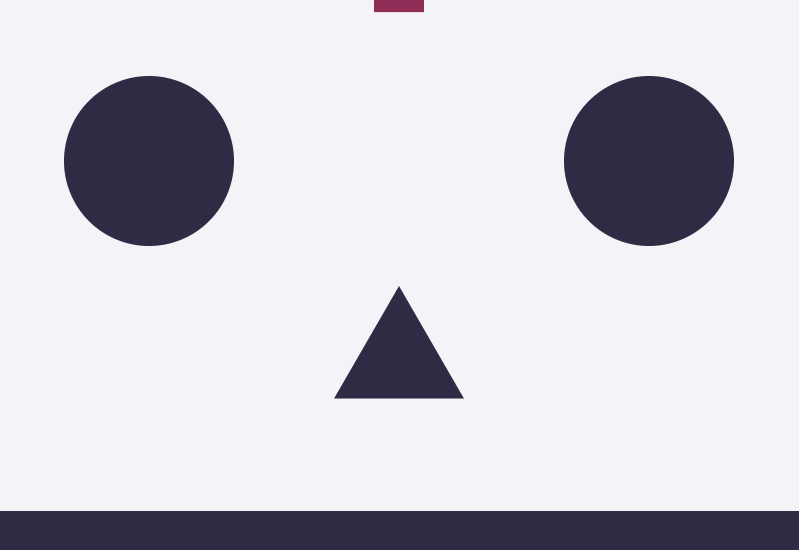

# Modular Game Worlds in Phaser 3 (Tilemaps #4) - Matter.js

Author: [Mike Hadley](https://www.mikewesthad.com/)

Reading this on GitHub? Check out the [medium post]() **INSERT LINK**.

This is the fourth post in a series of blog posts about creating modular worlds with tilemaps in the [Phaser 3](http://phaser.io/) game engine. In this edition, we'll

**INSERT IMAGE**

_↳ Caption_

If you haven't checked out the previous posts in the series, here are the links:

1.  [Static tilemaps & a Pokémon-style world](https://medium.com/@michaelwesthadley/modular-game-worlds-in-phaser-3-tilemaps-1-958fc7e6bbd6)
2.  [Dynamic tilemaps & puzzle-y platformer](https://medium.com/@michaelwesthadley/modular-game-worlds-in-phaser-3-tilemaps-2-dynamic-platformer-3d68e73d494a)
3.  [Dynamic tilemaps & Procedural Dungeons](https://medium.com/@michaelwesthadley/modular-game-worlds-in-phaser-3-tilemaps-3-procedural-dungeon-3bc19b841cd)

Before we dive in, all the source code and assets that go along with this post can be found in [this repository](https://github.com/mikewesthad/phaser-3-tilemap-blog-posts/tree/master/examples/post-4).

## Intended Audience

This post will make the most sense if you have some experience with JavaScript (classes, arrow functions & modules), Phaser and the [Tiled](https://www.mapeditor.org/) map editor. If you don't, you might want to start at the beginning of the [series](https://medium.com/@michaelwesthadley/modular-game-worlds-in-phaser-3-tilemaps-1-958fc7e6bbd6), or continue reading and keep Google, the Phaser tutorial and the Phaser [examples](https://labs.phaser.io/) & [documentation](https://photonstorm.github.io/phaser3-docs/index.html) handy.

Alright, Let's get into it!

## Overview

**INSERT CONTENT**
## First Steps with Matter

Phaser's implementation is a thin wrapper around the underlying Matter library, so if we want to use Matter in Phaser, we should start with learning Matter by itself. We'll create a simple setup where you can drop random shapes into a world:



Matter is structured around modules that contain factory functions that create objects and functions that can manipulate those objects. For example, the `Body` module is about creating & manipulating [rigidbodies](https://www.quora.com/What-is-a-rigid-body), so it has the `Body.create(...)` factory which will create a fresh body object for us, and `Body.applyForce(...)` which will apply a force to the given body object. So the first step we'll want to take is to alias a few of the modules:

```js
// If you are following along in codesandbox, or using modules locally:
import { Engine, Render, World, Bodies, Body } from Matter;

// Or, if you are using Matter loaded via a script (like in the GitHub repository associated with
// this post):
const { Engine, Render, World, Bodies, Body } = Matter;
```

Next, we'll want to create an engine and a renderer. Matter comes packaged with a simple canvas renderer, so we'll take advantage of that before moving into using Phaser.

```js
const engine = Engine.create();
const render = Render.create({
  element: document.getElementById("game-container"),
  engine: engine,
  options: {
    width: 800,
    height: 600,
    wireframes: false, // Draw the shapes as solid colors
    background: "#f4f4f8"
  }
});
```

Now that we've got a physics simulation and renderer, we can add some bodies to the world:

```js
// Create a rectangle centered at the top of the screen, (400, 0), with 120px width and 80px height
const rectangle = Bodies.rectangle(400, 0, 120, 80, { restitution: 0.25, angle: Math.PI / 4 });

// Create an immovable rectangle at the bottom of the screen that will act as the floor
const floor = Bodies.rectangle(400, 575, 800, 50, { isStatic: true });

// Add the newly minted bodies to our physics simulation
World.add(engine.world, [rectangle, floor]);

// Kick off the simulation and the render loops
Engine.run(engine);
Render.run(render);
```


Let's break that down. `Bodies.rectangle(400, 0, 120, 80, { restitution: 0.25 })` will create a new, rectangular physics body. It's positioned using the center of the body as the origin. The last parameter is an object that you can pass in to override the default [body properties](http://brm.io/matter-js/docs/classes/Body.html#properties). We've passed in an `angle` of Math.PI / 4 radians (45 degrees), which will override the default body rotation, 0 radians. We're passing in a `restitution` property here which specifies the elasticity of the body. By default it's 0 (inelastic), so we're overriding it to create a slightly bouncy rectangle. Other useful properties include: `friction`, `frictionAir`, `frictionStatic` and `density`.

The `floor` body can't be moved or rotated because we've flagged it as a static body using `isStatic`. So our rectangle will bounce off the floor without the floor moving.

We can introduce a few new body types (polygons & circles) and fill out our world:

```js
const DEGREES_TO_RADIANS = Math.PI / 180; // Helper to convert from degrees to radians

// Create some simple physics bodies, horizontally centered & above the top edge of the canvas
const rectangle = Bodies.rectangle(400, -300, 120, 80, { friction: 1, restitution: 0.25 });
const circle = Bodies.circle(400, -150, 50, { friction: 0, restitution: 1 });
// Polygon parameters: x, y, number of sides, radius of the shape, body options. A three-sided
// polygon will give us a triangle.
const triangle = Bodies.polygon(400, 0, 3, 50, { friction: 0, restitution: 0.5 });

// Create an immovable rectangle at the bottom of the screen that will act as the floor
const floor = Bodies.rectangle(400, 575, 800, 50, { isStatic: true });

// Create some vertical walls that are positioned just off screen.
const leftWall = Bodies.rectangle(-25, 400, 50, 800, { isStatic: true, friction: 0 });
const rightWall = Bodies.rectangle(825, 400, 50, 800, { isStatic: true, friction: 0 });

// Create some bouncy, static obstacles in the world for our bodies to ricochet off of
const obstacle1 = Bodies.circle(150, 200, 85, { isStatic: true, friction: 0, restitution: 1 });
const obstacle2 = Bodies.polygon(400, 400, 3, 75, {
  isStatic: true,
  angle: 90 * DEGREES_TO_RADIANS,
  friction: 0,
  restitution: 1
});
const obstacle3 = Bodies.circle(650, 200, 85, { isStatic: true, friction: 0, restitution: 1 });

World.add(engine.world, [
  rectangle,
  triangle,
  circle,
  floor,
  leftWall,
  rightWall,
  obstacle1,
  obstacle2,
  obstacle3
]);
```


We can also create compound bodies, bodies which have multiple parts that are linked together. The parts will move together as one object

```js
// Create a cross-shaped compound body that is composed of two rectangle bodies joined together
const verticalPart = Bodies.rectangle(400, 150, 100, 50);
const horizontalPart = Bodies.rectangle(400, 150, 50, 100);
const cross = Body.create({
  parts: [verticalPart, horizontalPart],
  friction: 0,
  restitution: 1
});

// Don't forget to add it to World.add(...)
```


The last piece we'll add is the ability to drop new polygons any time you click on the canvas:

```js
// A few random helper functions
const randomInRange = (min, max) => Math.random() * (max - min) + min;
const randomIntInRange = (min, max) => Math.floor(Math.random() * (max - min + 1) + min);

// Listen for mouse presses on the canvas and add a bunch of new bodies to the world
document.querySelector("canvas").addEventListener("mousedown", () => {
  for (let i = 0; i < 5; i++) {
    const x = randomInRange(50, 750);
    const y = randomInRange(0, 50);
    const radius = randomInRange(25, 50);
    const sides = randomIntInRange(3, 6);
    const body = Bodies.polygon(x, y, sides, radius, {
      friction: 0,
      restitution: 0.5
    });
    World.add(engine.world, body);
  }
});
```

[](https://codesandbox.io/s/w07j0jn57w?hidenavigation=1&module=%2Fjs%2Findex.js&moduleview=1)

<!-- Embed link for medium: https://codesandbox.io/s/w07j0jn57w?hidenavigation=1&module=%2Fjs%2Findex.js&moduleview=1 -->

_↳ Check out the [CodeSandbox](https://codesandbox.io/s/w07j0jn57w?hidenavigation=1&module=%2Fjs%2Findex.js&moduleview=1), [live example](https://www.mikewesthad.com/phaser-3-tilemap-blog-posts/post-4/01-matter) or the source code [here](https://github.com/mikewesthad/phaser-3-tilemap-blog-posts/blob/master/examples/post-4/01-matter)._

Now that we've got the Matter fundamentals, we can turn our attention to working with Matter & Phaser together. This [tutorial series](https://code.tutsplus.com/series/getting-started-with-matterjs--cms-1186)by Monty Shokeen if you want to dive deeper into Matter by itself.


## Up Next

**INSERT CLOSING**

Thanks for reading, and if there's something you'd like to see in future posts, let me know!

## About Me

I’m a creative developer & educator. I wrote the Tilemap API for Phaser 3 and created a ton of guided examples, but I wanted to collect all of that information into a more guided and digestible format so that people can more easily jump into Phaser 3. You can see more of my work and get in touch [here](https://www.mikewesthad.com/).
